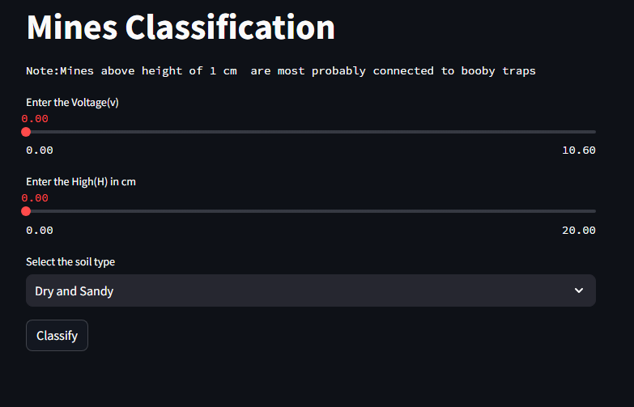
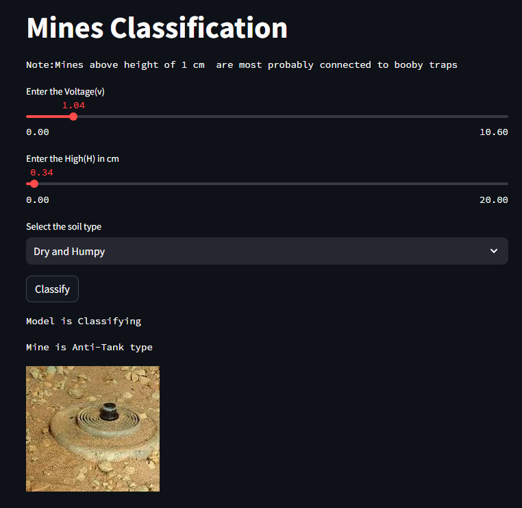
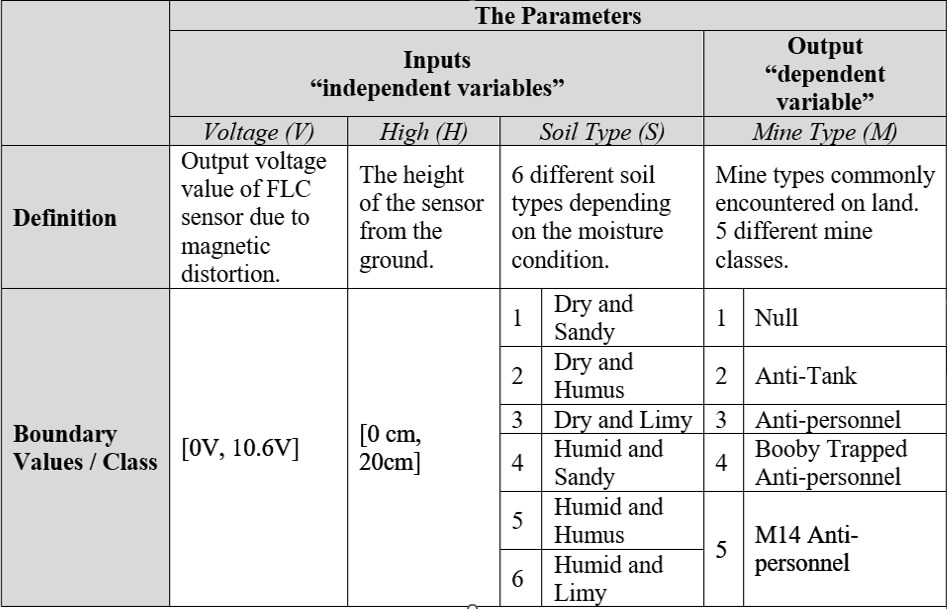

# Land MOne Classification Flask App

## Overview

This web application uses a Support Vector Machine (SVM) model to classify mine types based on input features such as voltage height and soil type. The app is built using Streamlit, a popular Python library for creating interactive web applications with minimal effort.
 I also applied the decision tree after the data is balanced and the accuracy improved. Thereby i update the code accourding to new accuracy 

## Prediction







## Citations/Acknowledgements
Yilmaz, C., Kahraman, H. T., & Söyler, S. (2018). Passive mine detection and classification method based on hybrid model. IEEE Access, 6, 47870-47888.
KAHRAMAN,Hamdi Tolga. (2022). Land Mines. UCI Machine Learning Repository. https://doi.org/10.24432/C54C8Z.

## Prerequisites

Ensure you have the following dependencies installed before running the application:

- Python (>=3.6)
- Streamlit
- scikit-learn
- Other necessary libraries (install via `pip install -r requirements.txt`)

## Getting Started

1. Clone the repository:

   ```bash
   git clone https://github.com/SARDARJI222/land_mines_classification.git
   
